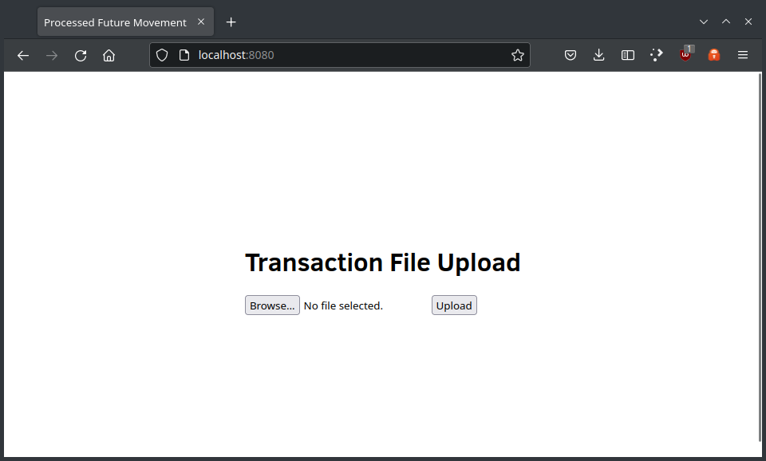
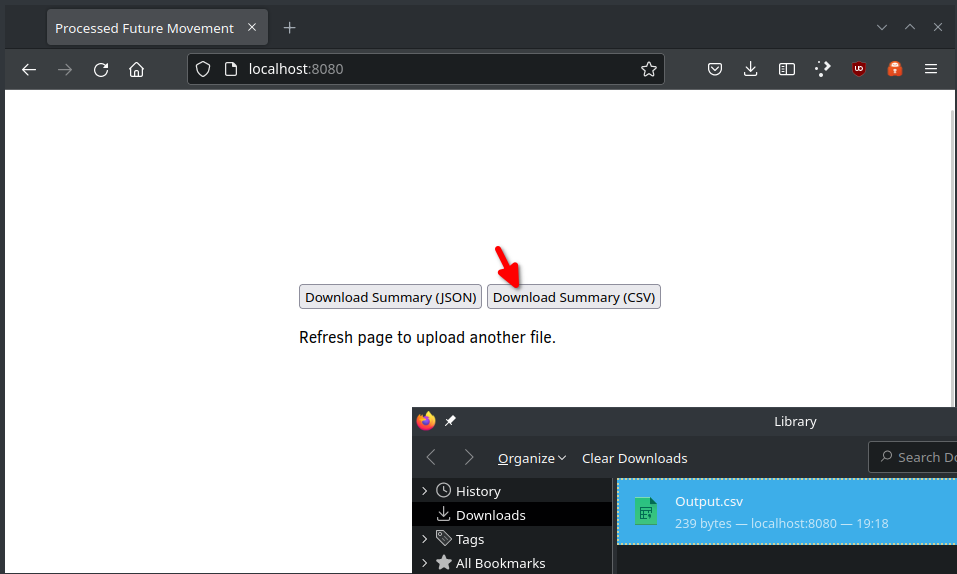
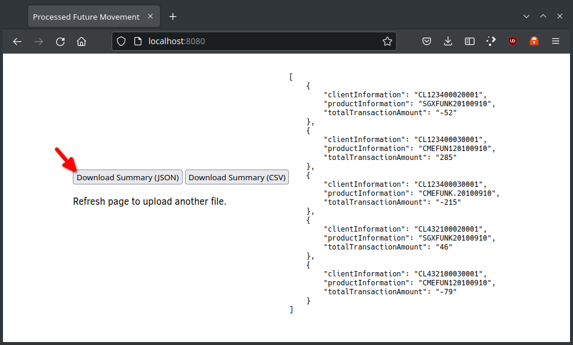

# processed-future-movement

This codebase was created to demonstrate an application that can read a future transactions input file and generate a daily summary report, in both JSON and CSV format.

It uses [Spring Batch](https://spring.io/projects/spring-batch) to read the transaction records from the input file, and write them into an in-memory H2 database.  

## Requirements

For building and running the application you need:

- [JDK 17](https://www.oracle.com/java/technologies/javase/jdk17-archive-downloads.html)
- [Maven 3](https://maven.apache.org)

## Running the application locally

One way is to execute the main method in the `au.id.keen.pfm.ProcessedFutureMovementApplication` class from your IDE.

Alternative you can use the [Spring Boot Maven plugin](https://docs.spring.io/spring-boot/docs/current/reference/html/build-tool-plugins-maven-plugin.html) plugin like so:

    mvn spring-boot:run

## Try it out with Docker

Using the [Spring Boot Maven plugin](https://docs.spring.io/spring-boot/docs/current/maven-plugin/reference/htmlsingle/#build-image) like so:

    mvn spring-boot:build-image -Dspring-boot.build-image.imageName=au.id.keen/pfm
    docker run -p 8080:8080 -t au.id.keen/pfm

Or using the [Dockerfile](Dockerfile):

    mvn install
    docker build -t au.id.keen/pfm .
    docker run -p 8080:8080 au.id.keen/pfm

## Database

It uses a H2 in-memory database for simplicity. 

# API

The API is accessible at `/api/v1`.

## POST -  /api/v1/upload

This URL accepts a file upload (the input file to be summarised). 

The JSON response contains data about the Spring Batch job that processed the file, including its ID, for example:

    { jobId: 1, jobStatus: "COMPLETED", message: null, detailedMessage: null }

####Future improvements

We could run the job asynchronously. Then the client would have to poll for when the job is completed. 
Or we could use websockets to inform the client when the job is completed. 

There is currently another GET URL at `/api/v1/job/{id}` which returns the current status of the requested job ID.

## GET - /api/v1/summary/{jobId}?format=csv

This URL returns the summary data in CSV format for the requested job ID. 

For example:

    Client_Information,Product_Information,Total_Transaction_Amount
    CL123400020001,SGXFUNK20100910,-52
    CL123400030001,CMEFUN120100910,285
    CL123400030001,CMEFUNK.20100910,-215
    CL432100020001,SGXFUNK20100910,46
    CL432100030001,CMEFUN120100910,-79

## GET - /api/v1/summary/{jobId}

This URL returns the summary data in JSON format for the requested job ID.

For example:

    [ 
        {"clientInformation":"CL123400020001","productInformation":"SGXFUNK20100910","totalTransactionAmount":"-52"},
        {"clientInformation":"CL123400030001","productInformation":"CMEFUN120100910","totalTransactionAmount":"285"},
        {"clientInformation":"CL123400030001","productInformation":"CMEFUNK.20100910","totalTransactionAmount":"-215"},
        {"clientInformation":"CL432100020001","productInformation":"SGXFUNK20100910","totalTransactionAmount":"46"},
        {"clientInformation":"CL432100030001","productInformation":"CMEFUN120100910","totalTransactionAmount":"-79"}
    ]

## Demonstration UI

There is a simple UI at the context root, for example, `http://localhost:8080/` that provides a file picker to upload a file, and retrieve the summary in both formats.

After uploading a file, and the job has completed, you can download the summary.

